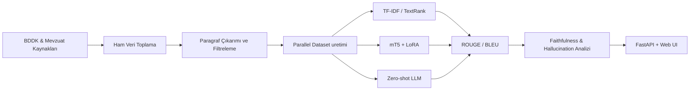
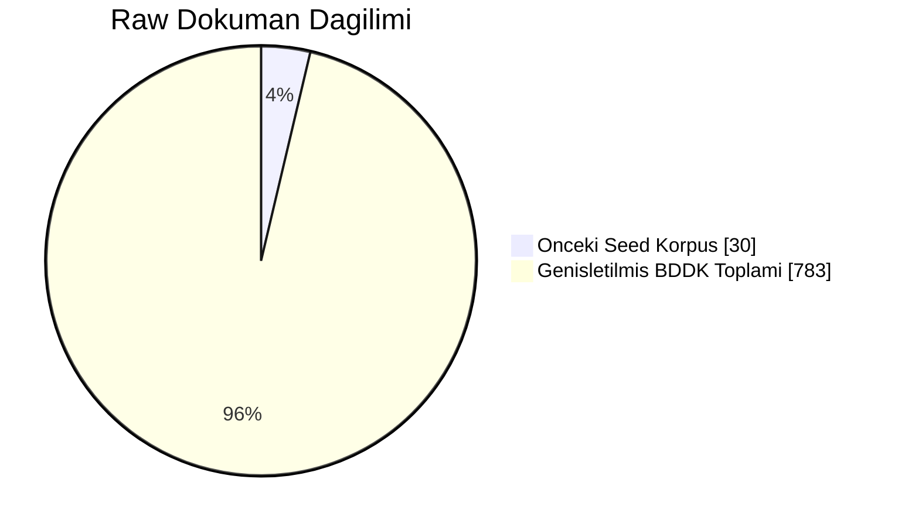

# Turkish Legal Banking Text Simplification

Turkish legal/banking metinlerini daha anlaşılır hale getirmek için hazırlanmış uçtan uca NLP pipeline: veri toplama, paragraf çıkarımı, baseline + neural + zero-shot karşılaştırması ve FastAPI tabanlı demo API.

## Ne Yapıyor?

- **Girdi:** Karmaşık Türkçe bankacılık/mevzuat metni
- **Çıktı:** Hukuki anlamı mümkün olduğunca koruyan sadeleştirilmiş metin
- **Kapsam:** BDDK + mevzuat kaynaklarından veri toplama, modelleme, değerlendirme, API sunumu

## Güncel Veri Özeti

Repository içindeki güncel artefaktlara göre:

- İşlenen ham doküman: **813**
- Çıkarılan karmaşık paragraf: **794**
- Ortalama karmaşıklık skoru: **1.61**
- Ortalama jargon yoğunluğu: **0.0608**
- Pilot test set boyutu (`data/parallel/test_gold.jsonl`): **7**

## Proje Akış Grafiği



## Veri Kompozisyonu (Grafik)



## Model Sonuclari (Pilot)

> Bu skorlar pilot olcektedir; final benchmark olarak yorumlanmamalidir.

| Yontem | ROUGE-1 | ROUGE-2 | ROUGE-L | BLEU |
|---|---:|---:|---:|---:|
| TF-IDF | 0.7647 | 0.6212 | 0.7647 | 0.2534 |
| TextRank | 0.7647 | 0.6212 | 0.7647 | 0.2534 |
| mT5 + LoRA | 0.0348 | 0.0000 | 0.0348 | 0.0000 |
| Zero-shot LLM | 0.2414 | 0.1865 | 0.2381 | 0.0350 |

## Klasor Yapisi

```text
api/                    FastAPI app (`api/main.py`)
configs/                Proje konfigurasyonu (`configs/default.yaml`)
data/
  raw/                  Ham dokumanlar (.md + .json)
  paragraphs/           Cikarilan kompleks paragraflar
  parallel/             train/val/test verisi
data_collection/        Scraper + extractor + synthetic tools
models/
  baseline/             TF-IDF / TextRank
  neural/               mT5 + LoRA
  zeroshot/             Prompt tabanli LLM
evaluation/             Karsilastirma ve guvenilirlik analizleri
results/                Skorlar, raporlar, checkpointler
web/                    Arayuz dosyalari
```

## Hizli Baslangic

```bash
make setup
make run
```

Alternatif:

```bash
./scripts/run_api.sh
```

API:
- UI: `http://127.0.0.1:8000/`
- Stats: `http://127.0.0.1:8000/api/stats`

## Veri Toplama Komutlari

```bash
# ID araligi ile toplama (genis corpus icin)
.venv/bin/python -m data_collection.bddk_scraper --mode range --start 1 --end 2500

# Config'teki dogrudan mevzuat URL'lerini toplama (elektronik bankacilik dahil)
.venv/bin/python -m data_collection.bddk_scraper --mode urls --config configs/default.yaml

# Paragraf datasetini guncelleme
.venv/bin/python -m data_collection.paragraph_extractor --config configs/default.yaml
```

## Deney Komutlari

```bash
# Baseline
.venv/bin/python -m models.baseline.evaluate_baselines --test-file data/parallel/test_gold.jsonl --output results/baseline_scores.json

# Neural evaluate
.venv/bin/python -m models.neural.evaluate --model-path results/neural_checkpoints/best_model --test-file data/parallel/test_gold.jsonl --output results/neural_scores.json

# Zero-shot
.venv/bin/python -m models.zeroshot.llm_simplifier --test-file data/parallel/test_gold.jsonl --output results/zeroshot_scores.json
```

## API Endpointleri

- `GET /` -> Web arayuzu
- `POST /api/simplify` -> Model secerek sadeleştirme
- `POST /api/analyze` -> Jargon/karmaşıklık analizi
- `GET /api/stats` -> Veri + model snapshot
- `GET /api/paragraphs?limit=20&offset=0` -> Paragraf gozlemi

## Sinirlar

- `test_gold` su an kucuk; kapsamli manuel gold set ile tekrar degerlendirme gerekli.
- Hukuki metinde anlam kaymasi kritik oldugu icin niteliksel inceleme zorunlu.
- API key yoksa zero-shot mod fallback ile calisir; bilimsel karsilastirma icin gercek LLM ciktilari tercih edilmelidir.

## Lisans

MIT (`LICENSE`)
